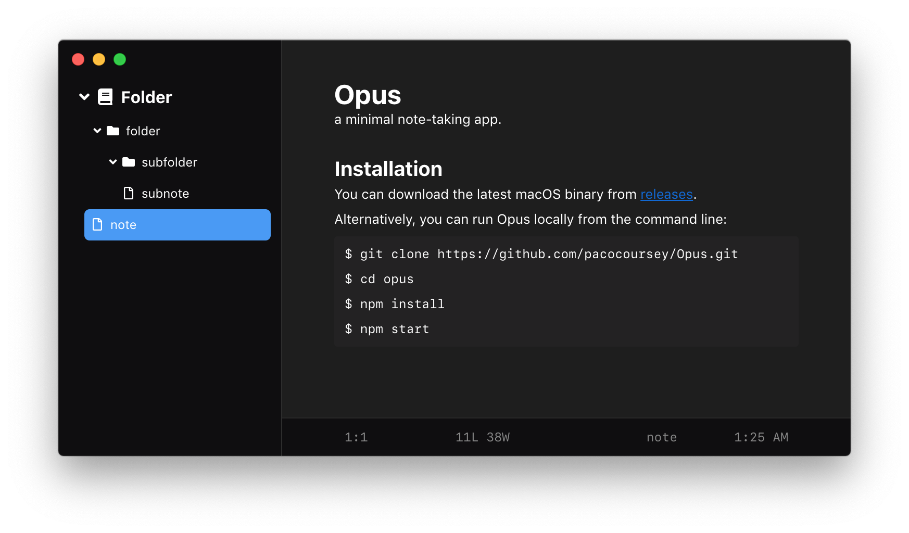

<p align="center">
  
</p>

# Opus

Opus is a minimal note-taking application.

It aims to be a mix between a text-editor and code-editor. It reads and writes `.note` files from your native file system. This means it works well with tools like Dropbox for syncing files across your devices.

Much like a code-editor, Opus opens folders and allows you to edit the files inside. You can have multiple windows open, each with a different folder.

## Features

- **Editing**: Supports rich text editing with all the features you'd expect.
- **Uses Files**: Uses tangible files in JSON format, not inaccessible databases.
- **Dark Mode**: Includes a dark mode for late night writing.
- **Customizable**: The sidebar and footer can be hidden for a more focused experience.
- **Multiple Projects**: Opus supports opening multiple folders at once.
- **Simple**: Opus has only the features you need.

## Installation

You can download the latest macOS binary from [releases](https://github.com/pacocoursey/Opus/releases/latest).

Alternatively, you can run Opus locally from the command line:

```bash
$ git clone https://github.com/pacocoursey/Opus.git
$ cd opus
$ npm install
$ npm start
```

## Screenshots




## More Features

- Find, replace, goto functionalities.
- Spellchecker, easily replace with suggestions via right-click.
- Window settings (position, size, dark mode, etc...) are remembered between sessions.
- Export notes to plain text, html, and markdown files.
- Automatically ask to update note contents if it is edited elsewhere.
- Document statistics shown in the footer (line count, word count, cursor position).

## Related

- [Left](https://github.com/hundredrabbits/left): distractionless plain text writing application.
- [Quill](https://github.com/quilljs/quill): The rich text editor that runs inside Opus.
